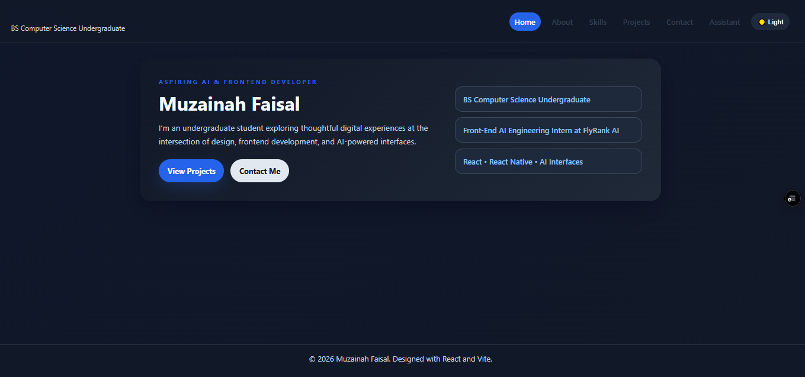
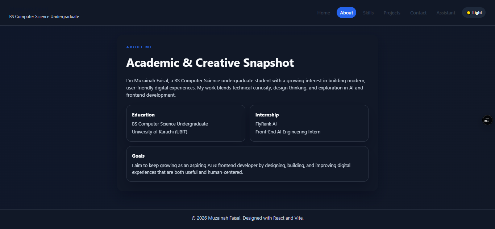
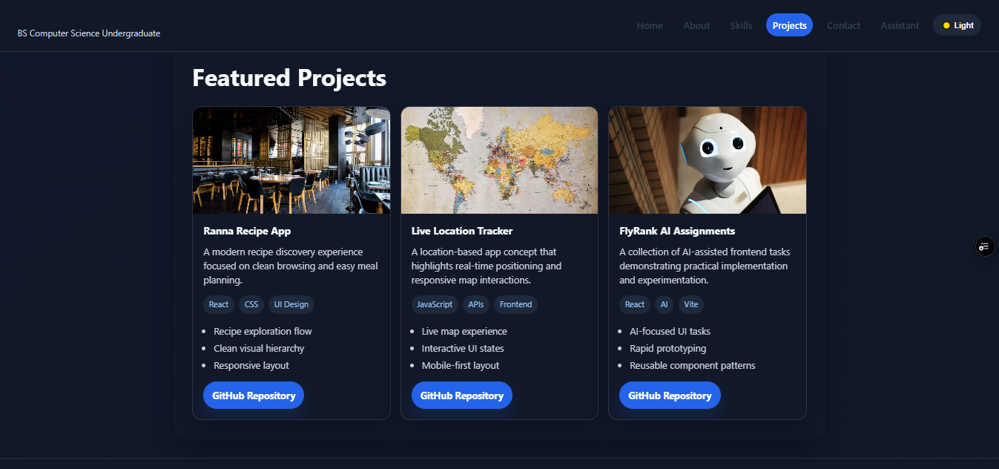
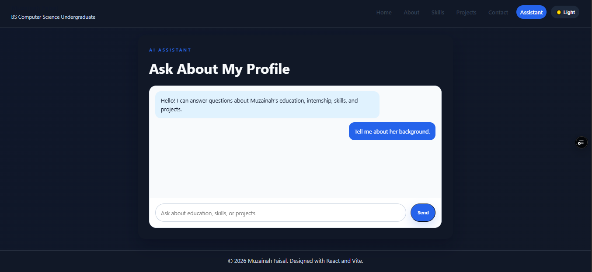

# AI Portfolio Capstone

A modern React + Vite portfolio website for Muzainah Faisal, featuring a responsive multi-page experience, a dark/light theme toggle, and an AI assistant page powered by a secure serverless proxy.

## Live Demo

https://capstone-muzainah-portfolio.vercel.app/

## Project Overview

This project is a professional AI fluency capstone website built with React, Vite, and React Router. It showcases personal information, education, internship experience, skills, featured projects, contact details, and an interactive AI assistant experience.

## Features

- Responsive multi-page portfolio layout
- Home, About, Skills, Projects, Contact, and Assistant pages
- Dark/light mode with local storage persistence
- Reusable navigation and footer components
- Modern chat-style AI assistant UI
- Secure serverless AI proxy for LLM requests
- Configurable LLM API integration via environment variables
- Clean, professional styling with hover effects and animations

## Technologies Used

- React
- Vite
- React Router
- CSS
- Environment-based API configuration

## Project Structure

- src/pages: page-level components
- src/components: reusable UI components
- src/App.jsx: app routing and layout shell
- src/App.css: main site styling

## Getting Started

### 1. Install dependencies

```bash
npm install
```

### 2. Create your environment file

Create a file named .env in the project root and add your values:

```env
LLM_API_KEY=your_api_key_here
LLM_API_URL=https://api.openai.com/v1/chat/completions
LLM_MODEL=gpt-4o-mini
```

> These values must be set in Vercel's dashboard for deployment. They are server-side variables and should not be exposed in a client-side Vite environment file.

You can also use the provided example file:

```bash
copy .env.example .env
```

### 3. Run the development server

```bash
npm run dev
```

The app will open locally in your browser.

## Available Scripts

```bash
npm run dev
npm run build
npm run preview
```

## Development Commands

- Start dev server: npm run dev
- Build for production: npm run build
- Preview production build: npm run preview

## Environment Variables

| Variable | Description |
| --- | --- |
| LLM_API_KEY | API key for the LLM provider, stored securely on the server |
| LLM_API_URL | Endpoint for the chat completions API |
| LLM_MODEL | Model name to use for the assistant |

## How the AI Assistant Works

The AI assistant uses a Vercel serverless function at /api/chat to keep the LLM key secure on the server instead of exposing it in the browser bundle. The assistant sends the current chat history to that proxy, which prepends a system prompt grounded in Muzainah's real background and forwards the request to the configured LLM provider.

By default, the implementation is designed for OpenAI-compatible chat completions using the model specified in LLM_MODEL (for example, gpt-4o-mini). The provider endpoint is configured through LLM_API_URL.

## Deployment

### Vercel

1. Push the project to GitHub.
2. Create a new Vercel project.
3. Import the repository.
4. Set LLM_API_KEY, LLM_API_URL, and LLM_MODEL in the Vercel dashboard under Project Settings → Environment Variables.
5. Deploy.

### Netlify

1. Build the project with npm run build.
2. Deploy the dist folder to Netlify.
3. Add environment variables in the Netlify dashboard.

## Screenshots






## Notes

- Keep the API key private and do not commit your .env file to GitHub.
- The assistant UI is ready for API integration and can be extended with richer prompts and responses.
